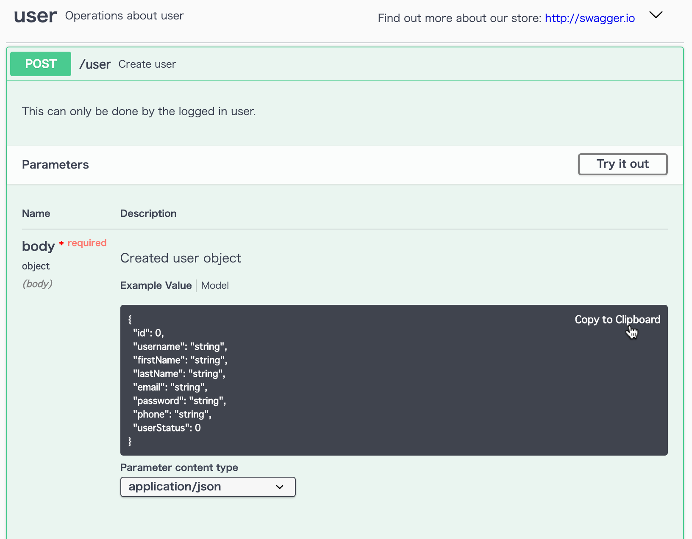

Swagger Copy
====

## About

Chrome Extension to copy JSON values displayed in Swagger UI code area to clipboard

## Screenshot

https://petstore.swagger.io/

## Target version

Swagger: xxx

## Todo

- Error: `[Intervention] Unable to preventDefault inside passive event listener due to target being treated as passive.`
- Some areas have JSON values directly under the `<pre>` tag
- fix taget URL
